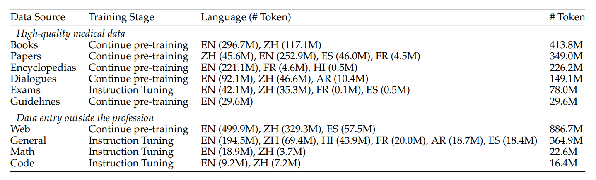

# Multilingual Medicine: Model, Dataset, Benchmark, Code

Covering English, Chinese, French, Hindi, Spanish, Hindi, Arabic So far
<center>

   
</center>


<p align="center">
   📃 <a href="https://arxiv.org/abs/2403.03640" target="_blank">Paper</a> • 🌐 <a href="https://apollo.llmzoo.com/" target="_blank">Demo</a> • 🤗 <a href="https://huggingface.co/datasets/FreedomIntelligence/ApolloCorpus" target="_blank">ApolloCorpus</a> • 🤗 <a href="https://huggingface.co/datasets/FreedomIntelligence/XMedbench" target="_blank">XMedBench</a> 
   <br>  <a href="./README_zh.md"> 中文 </a> | <a href="./README.md"> English
</p>


## 🌈 Update

* **[2024.03.07]** [Paper](https://arxiv.org/abs/2403.03640) released.
* **[2024.02.12]** <a href="https://huggingface.co/datasets/FreedomIntelligence/ApolloCorpus" target="_blank">ApolloCorpus</a> and  <a href="https://huggingface.co/datasets/FreedomIntelligence/XMedbench" target="_blank">XMedBench</a>  is published！🎉
* **[2024.01.23]** Apollo repo is published！🎉


## Results
   🤗 <a href="https://huggingface.co/FreedomIntelligence/Apollo-0.5B" target="_blank">Apollo-0.5B</a> • 🤗 <a href="https://huggingface.co/FreedomIntelligence/Apollo-1.8B" target="_blank">Apollo-1.8B</a> • 🤗 <a href="https://huggingface.co/FreedomIntelligence/Apollo-2B" target="_blank">Apollo-2B</a>  • 🤗 <a href="https://huggingface.co/FreedomIntelligence/Apollo-6B" target="_blank">Apollo-6B</a> • 🤗 <a href="https://huggingface.co/FreedomIntelligence/Apollo-7B" target="_blank">Apollo-7B</a> 
   
   
   
   
      
   

  


## Dataset & Evaluation

- Dataset
  🤗 <a href="https://huggingface.co/datasets/FreedomIntelligence/ApolloCorpus" target="_blank">ApolloCorpus

   <details><summary>Click to expand</summary>

    

    - [Zip File](https://huggingface.co/datasets/FreedomIntelligence/Medbase_data/blob/main/Medbase_data-datasets.zip)
    - [Data category](https://huggingface.co/datasets/FreedomIntelligence/Medbase_data/tree/main/train)
       - Pretrain:
         - data item:
            - json_name: {data_source}_{language}_{data_type}.json
            - data_type: medicalBook, medicalGuideline, medicalPaper, medicalWeb(from online forum), medicalWiki
            - language: en(English), zh(chinese), es(spanish), fr(french), hi(Hindi)
            - data_type: qa(generated qa from text)
            - data_type==text: list of string
              ```
              [
                "string1",
                "string2",
                ...
              ]
              ```
            - data_type==qa: list of qa pairs(list of string)
              ```
              [
                [
                  "q1",
                  "a1",
                  "q2",
                  "a2",
                  ...
                ],
                ...
              ]
              ```
      - SFT:
          - json_name: {data_source}_{language}.json
          - data_type: code, general, math, medicalExam, medicalPatient
          - data item: list of qa pairs(list of string)
            ```
              [
                [
                  "q1",
                  "a1",
                  "q2",
                  "a2",
                  ...
                ],
                ...
              ]
              ```


   </details>
   
- Evaluation
  🤗 <a href="https://huggingface.co/datasets/FreedomIntelligence/XMedbench" target="_blank">XMedBench</a> 

   <details><summary>Click to expand</summary>
      
     - EN:
       - [MedQA-USMLE](https://huggingface.co/datasets/GBaker/MedQA-USMLE-4-options) 
       - [MedMCQA](https://huggingface.co/datasets/medmcqa/viewer/default/test)
       - [PubMedQA](https://huggingface.co/datasets/pubmed_qa): Because the results fluctuated too much, they were not used in the paper.
       - [MMLU-Medical](https://huggingface.co/datasets/cais/mmlu)
         - Clinical knowledge, Medical genetics, Anatomy, Professional medicine, College biology, College medicine
     - ZH:
       - [MedQA-MCMLE](https://huggingface.co/datasets/bigbio/med_qa/viewer/med_qa_zh_4options_bigbio_qa/test)
       - [CMB-single](https://huggingface.co/datasets/FreedomIntelligence/CMB): Not used in the paper
         - Randomly sample 2,000 multiple-choice questions with single answer.
       - [CMMLU-Medical](https://huggingface.co/datasets/haonan-li/cmmlu)
         - Anatomy, Clinical_knowledge, College_medicine, Genetics, Nutrition, Traditional_chinese_medicine, Virology
       - [CExam](https://github.com/williamliujl/CMExam): Not used in the paper
         - Randomly sample 2,000 multiple-choice questions


     - ES: [Head_qa](https://huggingface.co/datasets/head_qa)
     - FR: [Frenchmedmcqa](https://github.com/qanastek/FrenchMedMCQA)
     - HI: [MMLU_HI](https://huggingface.co/datasets/FreedomIntelligence/MMLU_Arabic)
        - Clinical knowledge, Medical genetics, Anatomy, Professional medicine, College biology, College medicine
     - AR: [MMLU_Ara](https://huggingface.co/datasets/FreedomIntelligence/MMLU_Hindi)
        - Clinical knowledge, Medical genetics, Anatomy, Professional medicine, College biology, College medicine


   </details>

   
## Results reproduction
   <details><summary>Click to expand</summary>
   
   We take Gemma-2b as example
   1. Download Dataset for project:

      ```
      bash 0.download_data.sh
      ```
    
   2. Prepare test and dev for specific model:
      
      - Create test data for with special token, you can use ./util/check.ipynb to check models' special tokens

 
       ```
       bash 1.data_process_test&dev.sh
       ```
    
   3. Prepare train data for specific model (Create tokenized data in advance):
    
      - You can adjust data Training order and Training Epoch in this step

      
       ```
       bash 2.data_process_train.sh
       ```
    
   4. Train the model
    
      - If you want to train in Multi Nodes please refer to ./scripts/multi_node_train_*.sh

      
       ```
       bash 3.single_node_train_qwen.sh
       ```
    
   5. Evaluate your model: Generate score for benchmark
      
         ```
         bash 4.eval.sh
         ```

   6. Evaluate your model: Play with your ckpts in bash
    
         ```
         python ./src/evaluate/cli_demo.py --model_name='./ckpts/your/path/tfmr'
         ```
  
   
   </details>

##  To do list

- Open source Proxy Tuning code

##  Acknowledgment

- [HuatuoGPT-II](https://github.com/FreedomIntelligence/HuatuoGPT-II)
- [proxy-tuning](https://github.com/alisawuffles/proxy-tuning)

##  Citation
Please use the following citation if you intend to use our dataset for training or evaluation:

```
@misc{wang2024apollo,
   title={Apollo: Lightweight Multilingual Medical LLMs towards Democratizing Medical AI to 6B People},
   author={Xidong Wang and Nuo Chen and Junyin Chen and Yan Hu and Yidong Wang and Xiangbo Wu and Anningzhe Gao and Xiang Wan and Haizhou Li and Benyou Wang},
   year={2024},
   eprint={2403.03640},
   archivePrefix={arXiv},
   primaryClass={cs.CL}
}
```

## Star History

<a href="https://star-history.com/#FreedomIntelligence/Apollo&Date">
  <picture>
    <source media="(prefers-color-scheme: dark)" srcset="https://api.star-history.com/svg?repos=FreedomIntelligence/Apollo&type=Date&theme=dark" />
    <source media="(prefers-color-scheme: light)" srcset="https://api.star-history.com/svg?repos=FreedomIntelligence/Apollo&type=Date" />
    
  </picture>
</a>
