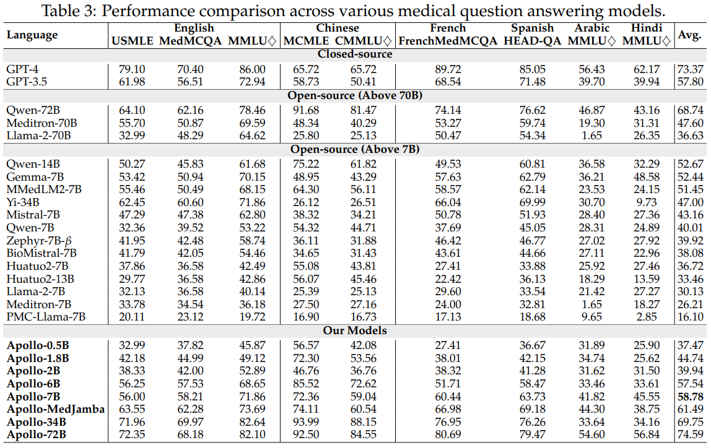

# Multilingual Medicine: Model, Dataset, Benchmark, Code

<center>

   
</center>


<p align="center">
   📃 <a href="" target="_blank">Paper</a> • 🌐 <a href="https://apollo.llmzoo.com/" target="_blank">Website</a> • 🤗 <a href="https://huggingface.co/datasets/FreedomIntelligence/ApolloCorpus" target="_blank">ApolloCorpus</a> • 🤗 <a href="https://huggingface.co/datasets/FreedomIntelligence/XMedBench" target="_blank">XMedBench</a> 
   <br>  <a href="./README_zh.md"> 中文 </a> | <a href="./README.md"> English
</p>

     

## 🌈 Update

* **[2024.02.12]** <a href="https://huggingface.co/datasets/FreedomIntelligence/Apollo_data" target="_blank">ApolloCorpus</a> and  <a href="https://huggingface.co/datasets/FreedomIntelligence/Apollo_eval" target="_blank">XMedBench</a>  is published！🎉
* **[2024.01.23]** Apollo repo is published！🎉


## Results
   🤗 <a href="" target="_blank">Apollo-0.5B</a> • 🤗 <a href="" target="_blank">Apollo-1.8B</a> • 🤗 <a href="" target="_blank">Apollo-2B</a>  • 🤗 <a href="" target="_blank">Apollo-6B</a> • 🤗 <a href="" target="_blank">Apollo-7B</a> 
   
   <details><summary>Click to expand</summary>
   
   
      
   
   </details>
  


## Dataset & Evaluation

- Dataset
  🤗 <a href="https://huggingface.co/datasets/FreedomIntelligence/Apollo_data" target="_blank">ApolloCorpus

- Evaluation
  🤗 <a href="https://huggingface.co/datasets/FreedomIntelligence/Apollo_eval" target="_blank">XMedBench</a> 


## Results reproduction
   <details><summary>Click to expand</summary>
   **Waiting for Update**
   1. Prepare Train/Test Data
      - [Back Translation using LLMs](https://github.com/FreedomIntelligence/Apollo/tree/main/src/process/openai_rewrite): Run Bash File
      - [Prepare Training tokens for LLMs](https://github.com/FreedomIntelligence/Apollo/tree/main/src/process/prepare): Run Bash File
   2. [Train your model](https://github.com/FreedomIntelligence/Apollo/tree/main/src/sft): Run Bash file
   3. [Evaluation](https://github.com/FreedomIntelligence/Apollo/tree/main/src/evaluate): Run Bash file
   
   </details>


##  Acknowledgment

This Repo is highly dependent on [HuatuoGPT-II](https://github.com/FreedomIntelligence/HuatuoGPT-II)

##  Citation
Please use the following citation if you intend to use our dataset for training or evaluation:

```
@misc{Apollo,
  title={Apollo, Multilingual Medicine: Model, Dataset, Benchmark, Code},
  author={Xidong Wang, Junyin Chen, Nuo Chen, Yidong Wang, Zhiyi Zhang, Benyou Wang},
  year = {2024},
  publisher = {GitHub},
  journal = {GitHub repository},
  howpublished = {\url{https://github.com/FreedomIntelligence/Apollo}},
}
```
